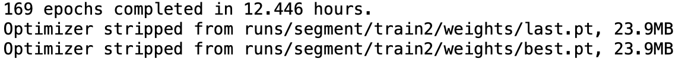
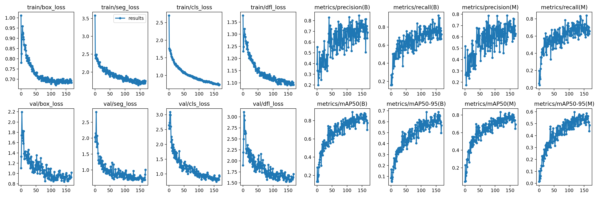
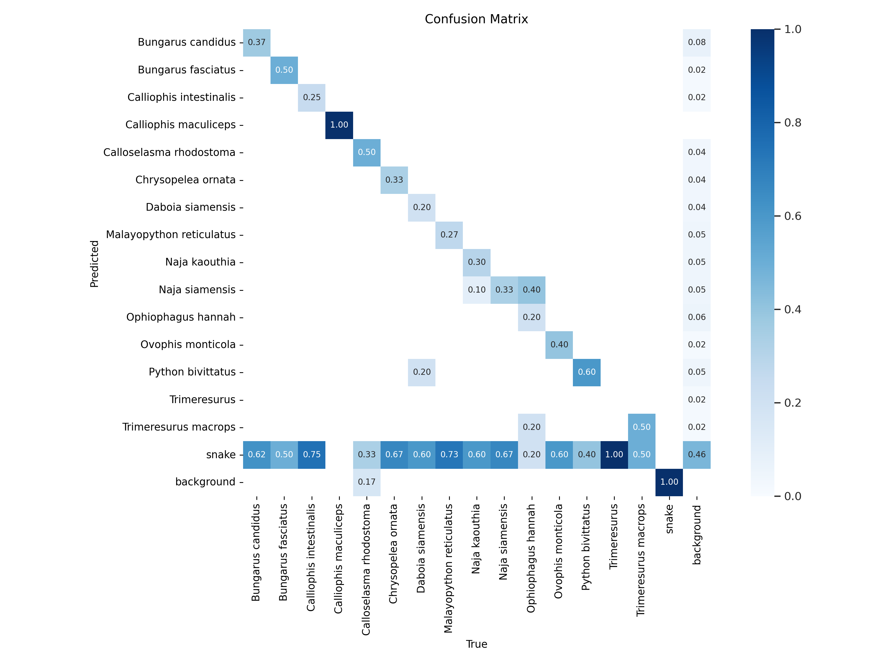
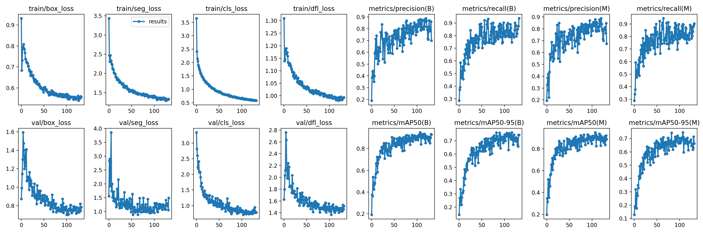
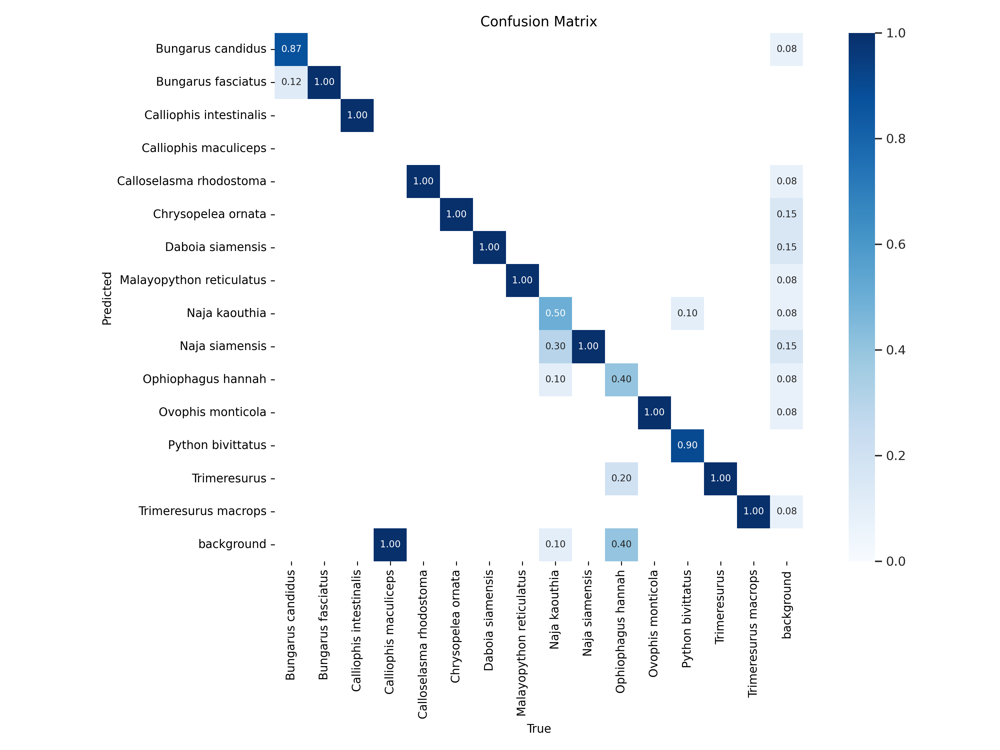

# ผลการเทรนโมเดล
| ลำดับ | ชื่อ | โมเดล | ครั้งที่ | Precision | Recall | F1 | Weighted Average Precision | Mean Average Precision, mAP | หมายเหตุ |
| :--- | :--- | :--- | :--- | :--- | :--- | :--- | :--- | :--- | :--- |
| 1 | [V1[YOLO8][26062569]_1](#1) | YOLO8 | 1 |  |  |  |  |  |  |
| 2 | [V1[YOLO8][26062569]_2](#2) | YOLO8 | 2 |  |  |  |  |  | ลบ class snake ออก |
|  |  |  |  |  |  |  |  |  |  |

## V1[YOLO8][26062569]_1
- บันทึกผล: 26/06/2569 16:00
- dataset: V2YOL8-segmentation
- segmentaion
- model: yolov8s-seg
- 300 epochs 16 batch
- ใช้เวลา: 12.446 hours
### Model Evaluation
- Precision:
- Recall:
- F1:
- Weighted Average Precision:
- Mean Average Precision, mAP:

## V1[YOLO8][26062569]_2
- บันทึกผล: 29/06/2569 15:00
- dataset: V3YOL8-segmentation
- segmentaion
- model: yolov8s-seg
- 300 epochs 16 batch
- ใช้เวลา: xxxxxx
### Model Evaluation
- Precision:
- Recall:
- F1:
- Weighted Average Precision:
- Mean Average Precision, mAP:

